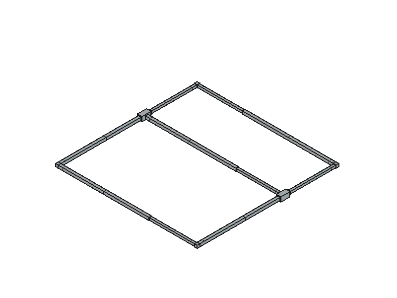

# ModuLo DIY

**ModuLo** is a *DIY* project to build an adaptable bed structure for your camper van or car.

## Table of Contents

- [Introduction](#introduction)
- [Technical Specifications](#technical-specifications)
- [Features](#features)
- [Bill of Materials](#bill-of-materials)
- [3D Printed Parts](#3d-printed-parts)
- [Assembly](#assembly)
- [Changelog](#changelog)
- [Authors](#authors)
- [License](#license)

## Introduction

The structure is built from aluminium square tubes joined with custom 3D-printed connectors and commercial legs. It can be assembled without welding or specialist tools, and adapted to any available space up to 2×2 meters by adjusting the tubes to the required length.

The aluminium construction keeps the overall weight low while maintaining sufficient rigidity for eventual use. The legs raise the frame off the surface, leaving usable storage space underneath. Its adaptable and modular design enhances portability and space usage, allowing the bed to be easily disassembled, transported, and reconfigured as needed.

All schematics and 3D design files are provided so the structure can be modified to fit specific use cases: different dimensions, alternative connector geometries, or additional layouts can be introduced by adjusting the source files directly.

This adaptable bed structure is ideal for camper vans or cars, providing a lightweight and stable sleeping platform that can be quickly assembled without tools. Its design makes it easy to fit different interiors while still allowing the vehicle to be used for storage or transport when disassembled.

## Technical Specifications

- **Frame:** adaptable rectangular aluminium structure
- **Tubes:** telescopic aluminium square profiles
  - Outer tube: 1000×30×30 mm, 2 mm wall
  - Inner tube: 1000×25×25 mm, 2 mm wall
- **Connectors:** custom 3D-printed structural joints
- **Legs:** commercial furniture legs, fixed or adjustable
- **Load surface:** plywood panel or slatted base
- **Load capacity:** up to 200 kg
- **Weight:** 12-15 kg

### Dimensions

| Parameter | Value |
|-----------|-------|
| Minimum dimensions | 1000×1000x300 mm |
| Maximum dimensions | 2000×2000x300 mm |
| Outer tube dimensions | 1000×30×30 mm |
| Inner tube dimensions | 1000×25×25 mm |
| Wall thickness | 2 mm |
| Leg height | 300 mm |

## Features

- **Fully adaptable:** adjust the tubes to any length to match your space, up to 2×2 meters
- **No welding required:** the connectors fit onto the tubes
- **Lightweight:** aluminium square tubes keep the overall weight low
- **3D-printed connectors:** 3D-printed L- and T-junction pieces
- **Standard legs:** uses commercial furniture legs
- **Under-bed storage:** leg height leaves usable storage space underneath for luggage or gear
- **Portable:** easy to disassemble, transport, and reconfigure

## Bill of Materials

| Qty | Part | Material | Unit cost | Total |
|-----|------|----------|----------:|------:|
| 5 | Outer tube 1000×30×30 mm | Aluminium square tube, 2 mm wall | 10€ | 50€ |
| 5 | Inner tube 1000×25×25 mm | Aluminium square tube, 2 mm wall | 8€ | 40€ |
| 1 | L connector 30×30 mm to 30×30 mm | PLA / ABS / PETG (3D printed) | 1€ | 1€ |
| 1 | L connector 25×25 mm to 25×25 mm | PLA / ABS / PETG (3D printed) | 1€ | 1€ |
| 2 | L connector 25×25 mm to 30×30 mm | PLA / ABS / PETG (3D printed) | 1€ | 2€ |
| 1 | T connector 30×30 mm | PLA / ABS / PETG (3D printed) | 1€ | 1€ |
| 1 | T connector 25×25 mm | PLA / ABS / PETG (3D printed) | 1€ | 1€ |
| 9 | Leg 300 mm | Commercial furniture leg | 5€ | 45€ |
| 1 | Load surface | Plywood panel or slatted base | 20€ | 20€ |
| | | | **Estimated total*** | **161€** |

**Costs are approximate retail estimates. 3D-printed part costs reflect material only.*

## 3D Printed Parts

All source designs are in [`src/`](src/). Printable parts can be found in [`src/parts/`](src/parts/).

| File | Part |
|------|------|
| `L_connector_30x30_mm_to_30x30_mm.stl` | L connector 30×30 mm to 30×30 mm |
| `L_connector_25x25_mm_to_25x25_mm.stl` | L connector 25×25 mm to 25×25 mm |
| `L_connector_25x25_mm_to_30x30_mm.stl` | L connector 25×25 mm to 30×30 mm |
| `T_connector_30x30_mm.stl` | T connector 30×30 mm |
| `T_connector_25x25_mm.stl` | T connector 25×25 mm |

### Recommended print settings

- Material: ABS / PETG (better temperature and humidity resistance than PLA)
- Layer height: 0.2 mm
- Infill: ≥ 60%
- Walls: ≥ 4 perimeters

## Assembly

1. **Assemble the telescopic tubes:** Insert each inner tube into a corresponding outer tube to form 5 telescopic tubes.
2. **Fit the T connectors:** Fit the T connectors onto one telescopic tube to build the cross section tubes.
3. **Connect the cross tubes:** Slide two telescopic tubes into the T connectors, one per connector.
4. **Complete the frame:** Join the remaining telescopic tubes to the open ends of the cross tubes using the L connectors to close the rectangular frame.
5. **Attach the legs:** Fix the legs to the underside of the frame at the corners and intermediate support positions.

## Changelog

All notable changes to this project will be documented in this section.

### [1.1] - 2026-06-04

#### Changed

- Updated connector sizing for higher tighten connections
- Updated parts file names in README.md

### [1.0] - 2026-06-04

#### Added

- Initial design created

## Authors

- Asier Pabolleta Martorell <[apabolleta@gmail.com](mailto:apabolleta@gmail.com)> ([apabolleta.github.io](https://apabolleta.github.io))

## License

This project is released under the [CC BY-SA 4.0](https://creativecommons.org/licenses/by-sa/4.0/) license. Share and adapt freely with attribution.
